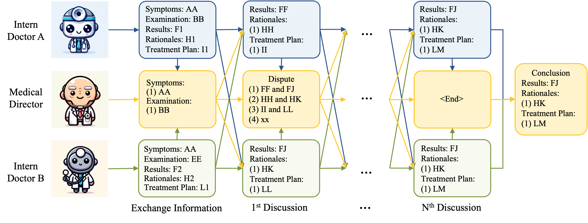

# AI Hospital: Interactive Evaluation and Collaboration of Large Language Models as Intern Doctors for Clinical Diagnosis [[Paper]](https://arxiv.org/abs/2402.09742)


Welcome to the repository for our research paper, "AI Hospital: Interactive Evaluation and Collaboration of Large Language Models as Intern Doctors for Clinical Diagnosis." This repository hosts our primary simulation module tailored for various medical roles involved in the study.

## Environment Setup
To set up your environment, run the following command:
```
pip install -r requirements.txt
```

## Multi-View Medical Evaluation (MVME) Benchmark
Our study introduces the MVME Benchmark for evaluating Large Language Models (LLMs) in the role of intern doctors for clinical diagnosis. We have developed our medical record dataset, available for review at [our medical record dataset](src/data/patients.json), sourced from [iiyi](https://bingli.iiyi.com/).

### Review Existing LLMs
You can find the dialog history documents of LLMs featured in our study at [Dialog_History](src/outputs/dialog_history_iiyi/). Additionally, the one-step diagnostic reports are located in [One-Step](src/outputs/onestep_iiyi/onestep_gpt4_iiyi_patients.jsonl).

### Replication Instructions

Navigate to the source directory:
```
cd ./src
```
Before running the script, open `scripts/run.sh` and enter your API keys for the required services. For instance:
- For OpenAI Models (e.g., GPT-4): `OPENAI_API_KEY=""`, `OPENAI_API_BASE=""`
- For Alibaba Models (e.g., Qwen-Max): `DASHSCOPE_API_KEY=""`
- For Wenxin Models (e.g., Wenxin-4.0): `WENXIN_API_KEY=""`, `WENXIN_SECRET_KEY=""`

Execute the script with:
```
bash scripts/run.sh
```

### Evaluating Quantitative Performance
To assess the performance, navigate to the source directory and execute:
```
cd ./src
bash scripts/eval.sh
```

### Creating Your Intern Doctor Agent 
#### Step 1: Implementation
To develop your intern doctor agent, base your implementation on the [Doctor](src/agents/doctor.py) class. Refer to GPTDoctor for agents requiring online API calls or HuatuoGPTDoctor for GPU-dependent agents.

#### Step 2: Registration
Register your model in the [initialization file](src/agents/__init__.py) within the agents directory.

## Collaborative Diagnosis with LLMs: Focus on Dispute Resolution


### Replication Instructions

Navigate to the source directory:
```
cd ./src
```
Open `scripts/run_md.sh` and input your API keys for the necessary services as described above.

Execute the script with:
```
bash scripts/run_md.sh
```

## Authors and Citation

This study was authored by Zhihao Fan, Jialong Tang, Wei Chen, Siyuan Wang, Zhongyu Wei, Jun Xie, Fei Huang, and Jingren Zhou. We encourage the use of our code and data in your research and kindly request citation of our paper as follows:

```BibTeX
@article{fan2024ai,
  title={AI Hospital: Interactive Evaluation and Collaboration of LLMs as Intern Doctors for Clinical Diagnosis},
  author={Fan, Zhihao and Tang, Jialong and Chen, Wei and Wang, Siyuan and Wei, Zhongyu and Xi, Jun and Huang, Fei and Zhou, Jingren},
  journal={arXiv preprint arXiv:2402.09742},
  year={2024}
}
```