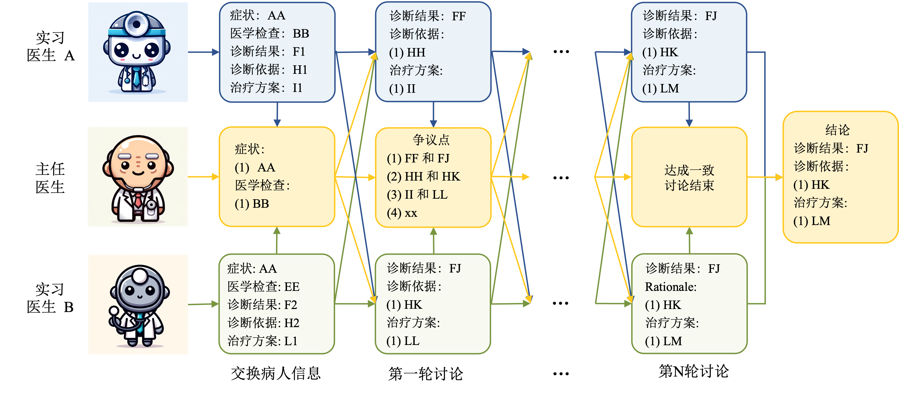

# AI Hospital: Interactive Evaluation and Collaboration of Large Language Models as Intern Doctors for Clinical Diagnosis [[Paper]](https://arxiv.org/abs/2402.09742)


欢迎来到我们的研究论文“人工智能医院：大型语言模型作为实习医生进行临床诊断的互动评估与合作”的代码仓库。该仓库托管了我们为研究中涉及的各种医疗角色量身定制的主要模块。

## 环境设置
运行以下命令以设置您的环境：
```
pip install -r requirements.txt
```

## 多维度医学评估（MVME）基准
我们的研究提出了MVME基准，用于评估大型语言模型（LLMs）作为实习医生进行临床诊断的角色。我们开发了自己的医疗记录数据集，可在[我们的医疗记录数据集](src/data/patients.json)中查看，数据来源于[医易网](https://bingli.iiyi.com/)。

### 查看现有的LLMs
您可以在[对话诊疗历史记录](src/outputs/dialog_history_iiyi/)中找到我们研究中使用的LLMs的对话历史文档。此外，单步诊断报告位于[单步](src/outputs/onestep_iiyi/onestep_gpt4_iiyi_patients.jsonl)中。

### 复现指南

进入源目录：
```
cd ./src
```
运行脚本前，打开`scripts/run.sh`并输入所需服务的API密钥。例如：
- 对于OpenAI模型（例如，GPT-4）：`OPENAI_API_KEY=""`，`OPENAI_API_BASE=""`
- 对于阿里巴巴模型（例如，Qwen-Max）：`DASHSCOPE_API_KEY=""`
- 对于文心模型（例如，文心-4.0）：`WENXIN_API_KEY=""`，`WENXIN_SECRET_KEY=""`

执行脚本：
```
bash scripts/run.sh
```

### 评估性能
要评估性能，请进入源目录并执行：
```
cd ./src
bash scripts/eval.sh
```

### 创建您的实习医生代理 
#### 步骤1：实现
要创建您的实习医生代理，请基于[Doctor](src/agents/doctor.py)类进行实现。参考需要在线API调用的GPTDoctor或依赖GPU的HuatuoGPTDoctor。

#### 步骤2：注册
在代理目录的[初始化文件](src/agents/__init__.py)中注册您的模型。

## LLMs合作诊断的新机制：如何解决争议？


### 复现指南

进入源目录：
```
cd ./src
```
打开`scripts/run_md.sh`并输入所需服务的API密钥，如上所述。

执行脚本：
```
bash scripts/run_md.sh
```

## 引用

如果我们的代码和数据对您的研究工作有所帮助，希望您可以按照以下方式引用我们的论文：

```BibTeX
@article{fan2024ai,
  title={AI Hospital: Interactive Evaluation and Collaboration of LLMs as Intern Doctors for Clinical Diagnosis},
  author={Fan, Zhihao and Tang, Jialong and Chen, Wei and Wang, Siyuan and Wei, Zhongyu and Xi, Jun and Huang, Fei and Zhou, Jingren},
  journal={arXiv preprint arXiv:2402.09742},
  year={2024}
}
```